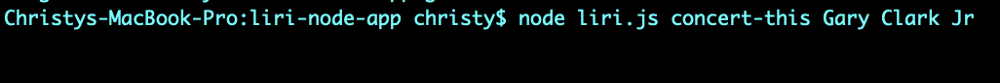
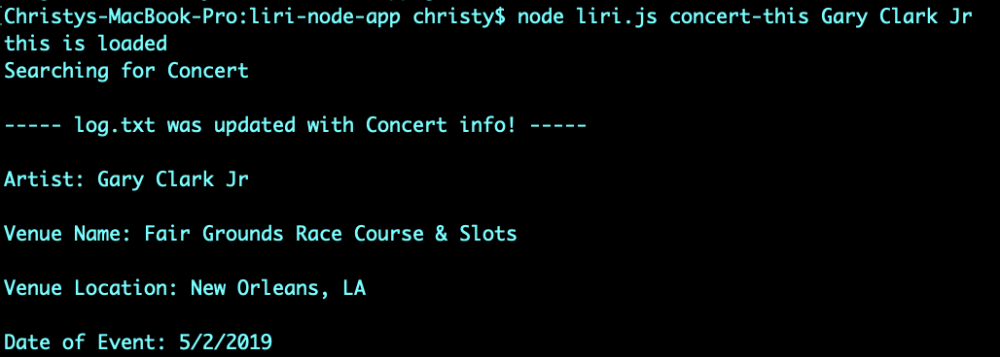
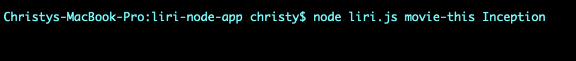
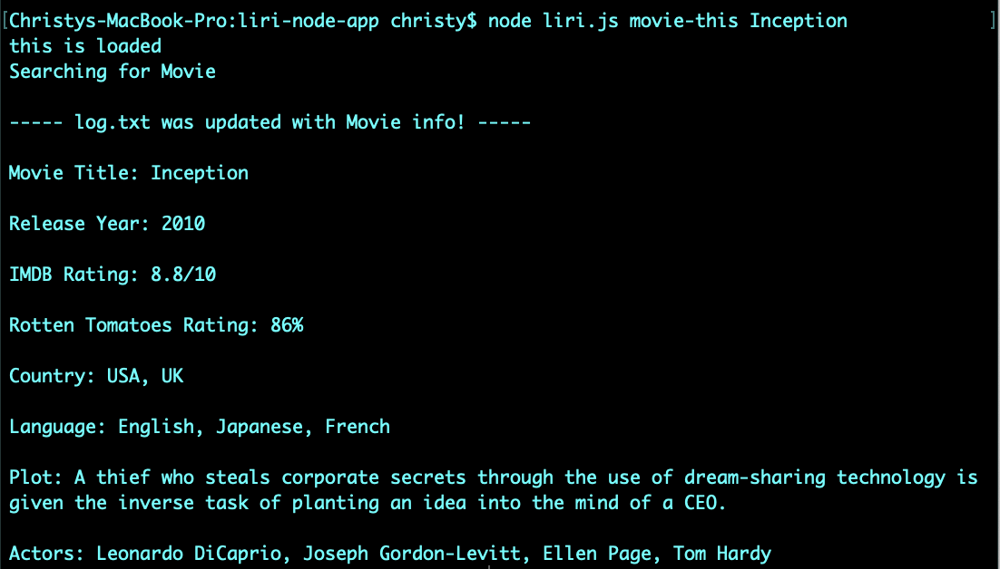
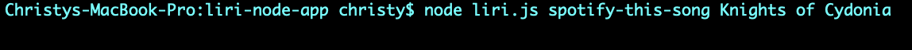
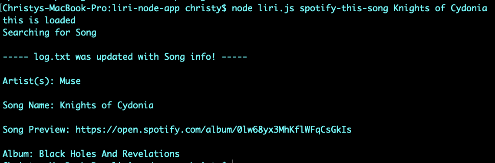
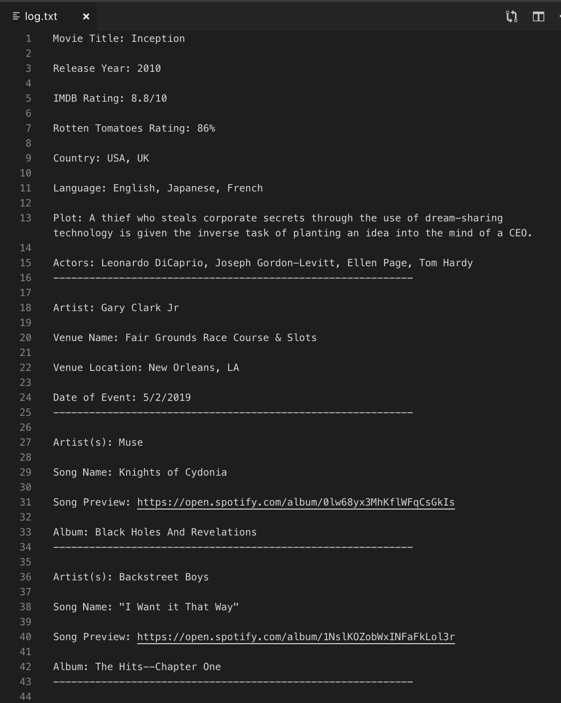

# Ask Liri

## What is Liri? ##

Liri is like iPhone's Siri. However, while Siri is a Speech Interpretation and Recognition Interface, Liri is a Language Interpretation and Recognition Interface. Liri is a command line node app that takes in parameters and gives you back data.

## How does Liri work? ##

To retrieve data to power the app, I send requests using the following Node packages:
* Axios (used to grab data from OMDB API & Bands in Town API): https://www.npmjs.com/package/axios
* Node-Spotify-API: https://www.npmjs.com/package/node-spotify-api
* Moment: https://www.npmjs.com/package/moment
* DotEnv: https://www.npmjs.com/package/dotenv

**These all need to be installed using `npi install <package name>` in order for the app to work.**

In this app, Liri will search Spotify for songs, Bands in Town for concerts, and OMDB for movies.

Liri can take in one of the following commands and log the data to your terminal/bash window:
* concert-this
* movie-this
* spotify-this-song
* do-what-it-says

Additionally, using appendFile, the data will be logged to a log.txt file.

## What does each command do? ##

1. `node liri.js concert-this <artist/band name here>`
    * Using the axios Node package, this will search the Bands in Town Artist Events API for an artist and render the following info about each event to the terminal/bash window:
        - Name of the venue
        - Venue location
        - Date of the Event (used moment to format this as "MM/DD/YYYY")

Step 1: npm install axios

Axios successfully installed!

Step 2: Enter concert-this command as listed above + the artist/band name

Concert data rendered

2. `node liri.js movie-this <movie name here>`
    * Using the axios package, this will search the OMDB API for a movie and output the following info about each movie to the terminal/bash window:
        - Title of the movie.
        - Year the movie came out.
        - IMDB Rating of the movie.
        - Rotten Tomatoes Rating of the movie.
        - Country where the movie was produced.
        - Language of the movie.
        - Plot of the movie.
        - Actors in the movie.

Step 1: npm install axios

Axios successfully installed!

Step 2: Enter movie-this command as listed above + the movie name

Movie data rendered

3. `node liri.js spotify-this-song <song name here>`
    * Using the node-spotify-api Node package, this will search the Spotify API for a song and show the following info about the song in your terminal/bash window:
        - Artist(s)
        - The song's name
        - A preview link of the song from Spotify
        - The album that the song is from

Step 1: npm install node-spotify-api

Node Spotify-API successfully installed!

Step 2: Enter spotify-this-song command as listed above + the song track

Song data rendered

4. `node liri.js do-what-it-says`
    * Using the fs Node package, Liri will take the text inside of random.txt and then use it to call one of Liri's commands.

The data is also logged to a log.txt file.

### Thanks for visiting and enjoy the app! ###

